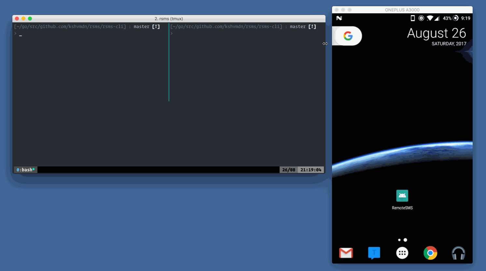

## rsms

> View, stream, and send SMS messages from your Android device on any machine.

### Contents

  - [Why?](#why)
  - [Demo](#demo)
  - [Design](#design)
  - [Components](#components)
  - [Contribute](#contribute)
  - [License](#license)

### Why?

I often find myself in a situation where my phone is somewhere across the room and I'm receiving messages that I don't even know about. Being the lazy developer I am, it made more sense to build something that allowed me to remotely send/receive messages than remembering to keep my phone on me.

There are various closed source alternatives, but I couldn't seem to find anything open source (do let me know if something exists!). Also, if I'm not mistaken, [_something like this_](https://support.apple.com/en-ca/HT202549) ships with macOS for use with iOS.

### Demo

### Design

rsms allows you to interface with SMS on your Android device.

The mobile application runs 2 individual servers:

  1. HTTP server for the REST API for sending SMS messages and accessing previous conversations (using [NanoHttpd/nanohttpd](https://github.com/NanoHttpd/nanohttpd)).
  2. WebSocket server for streaming incoming messages in real-time (using [TooTallNate/Java-WebSocket](https://github.com/TooTallNate/Java-WebSocket)).

The CLI acts as a client to interface with the 2 servers. This component is completely optional and you can use your own HTTP / WebSocket clients if you prefer (e.g. cURL, HTML5 WebSockets, etc.), refer to [mobile/README.md](./mobile/README.md) for some API documentation.

### Components

- [Mobile](./mobile)
- [CLI](./cli)

### Contribute

This project is completely open source. Feel free to open an [issue](https://github.com/kshvmdn/rsms/issues) or submit a [pull request](https://github.com/kshvmdn/rsms/pulls). View each component for specific tasks and instructions.

I don't have any plans to extend support to iOS (not sure if it's even possible), but feel free to submit something if interested.

### License

rsms source code is released under the [MIT license](./LICENSE).
